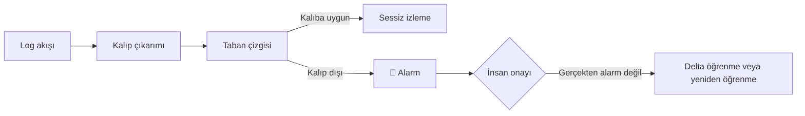

# SRE-FOR-ALL

> Logunuzun formatı ne olursa olsun, onu okuruz. Log içeriğindeki anomalileri yakalar, sağlıklı akışı öğrenir ve öğrenilenin dışına çıkan her akışta alarm üretiriz — her şey tamamen sizin ortamınızda, sizin gözetiminizde.

🚀 **Durum: uçtan uca ÇALIŞIYOR.** Güncel ilerleme:

- ✅ **Öğrenme döngüsü tamam:** `sanitize → chunk → LLM kalıp öğrenimi → clean` — `pipeline.py` raunt raunt otomatik döndürür, kapsam her raunt büyür
- ✅ **Dairesel rastgele pencere:** her raunt dosyanın RASTGELE bir bölgesinden dilim alır (kütleyle oranlı örnekleme) — dev kalıp aileleri ilk rauntlarda yakalanır
- ✅ **Canlı mission-control GUI:** koşuyu başlat/durdur, kalıpları, dosya ağacını, canlı konsolu izle (Docker opt-in, `127.0.0.1:8080`)
- ✅ **Sıfır bağımlılık:** tamamı Python standart kütüphanesi — derlenmiş kod yok, siyah kutu yok
- ✅ **Sınanmış:** linux.log (syslog, 2,3 MB, bilinmedik format) → **%78,76 kapsam / 9 raunt / 82 kalıp** (37'si error işaretli)

Modüllerin kimlik kartları: [`MODULES.md`](MODULES.md) · oturum günlüğü: [`DEVLOG.md`](DEVLOG.md)

---

## Kapsam — net çizgiler

Bu yazılım **log içeriğini** anlar: logunuzdaki mevcut yapıyı çözer, uygulamayla ilgili hataları ve olağan dışı durumları yakalar; uygulama özelinde bir sorun varsa alarm üretir. Müşterinin *davranışındaki* anomaliyi (ör. alışkanlıklarının değişmesi) bulmaz — bu, yazılımın kapsamı dışındadır.

### ✅ Neleri yapar?

- **Uygulama loglarında oluşan müşteri veya uygulama hatalarını** — yani normalde oluşmayan şeyleri — yakalar ve alarm üretir.
- **Bilinen "yalancı" hataları ayıklar:** logda error kaydı vardır ama gerçekte hata değildir; bu formlar öğrenilir ve gürültüye dönüşmez.
- **Deployment sonrası görünürlük sağlar:** deploy sonrası beklenmedik durumları veya yeni log tiplerini görüntülemeyi kolaylaştırır.
- **LLM çağrı maliyetini düşürür:** kalıplar + tekrar sayıları, az sayıda çağrıyla tam kapsamlı analiz sağlar; kalıp dışı kalanlar anomali adayı havuzudur.

### ❌ Neleri yapmaz?

- Uygulama **log üretmezse** onu yakalamaz.
- Normalden **az** log üretmeyi yakalamaz (hacim anomalisi kapsam dışıdır).

## Nasıl çalışır?

```
orijinal log (herhangi bir format)
   │
   ▼  sanitize — format körü temizlik (noktalama→boşluk, _SOL_ ... _EOL_ sarmalama)
   ▼  chunk — ~10k tokenluk dilim, RASTGELE bir bölgeden (dosya sonuna değince başa sarar)
   ▼  LLM — dilimdeki tekrar eden olayları ŞABLON haline getirir
           (tek satırlık INFO'dan 40 satırlık hata bloğuna kadar; regex + okunabilir iskelet + healthy/error etiketi)
   ▼  clean — öğrenilen şablonlarla eşleşenler elenir, kalanlar yeni rauntun girdisi
   └──► raunt raunt döner: kapsam tırmanır, öğrenilecek kalmayınca durur
```

Her raunt kendi klasörüne yazar: chunk, LLM istek/yanıt kayıtları (wire log), öğrenilen kalıplar, özet, eşleşenler ve kalanlar. Kalan son dosya (`unmatched.log`) = **anomali adayı havuzu**.



## Hızlı başlangıç — üç yol

### A) GUI ile (önerilen)

```bash
docker compose up -d --build            # geliştirme konteyneri
docker compose --profile gui up -d gui  # canlı dashboard (opt-in)
# Windows/Mac tarayıcı: http://localhost:8080
```

Dosyayı gezinenden seç → **▶ BAŞLAT**. Kapsam grafiği, kalıp tablosu, canlı konsol ve dosya ağacı akar; **■ DURDUR** her an elinin altında.

### B) Tek komutla (terminal)

```bash
ssh -p 2222 dev@127.0.0.1   # konteynere (docker compose up -d --build ile geldiyse)
python3 python_scripts/pipeline.py \
  --input /workspace/example_logs/ornek.log \
  --workdir /workspace/data/ilk_kosu \
  --max-rounds 20
```

Duruş kuralları: raunt sınırı · kazanç eşiği (`--min-round-gain-pct`, varsayılan 1 puan) · "öğrenilecek kural kalmadı" · kırmızı bayrak (herhangi bir adım hata verirse anında dur, sebep raporda).

### C) AI asistanınıza yaptırın ↓

## 🤖 AI asistanınız için hazır görev talimatı

Bu bloğu olduğu gibi kopyalayıp Claude / ChatGPT / Cursor gibi asistanınıza verin — projeyi sizin yerinize koşturup **sonucu size özetlesin:**

```text
SRE-FOR-ALL adlı yerel log-kalıp-öğrenme aracını benim için çalıştır ve sonucu özetle.

ORTAM: Bu reponun kökündesin; Docker kurulu.
1) Servisleri kaldır:
   docker compose up -d --build && docker compose --profile gui up -d gui
2) Konteynere gir: docker exec -it <sre-dev konteyneri> bash  (proje /workspace altında)
3) LLM anahtarı: /secrets/zai.env dosyasında ZAI_API_KEY/ZAI_MODEL/ZAI_BASE_URL
   tanımlıysa hiçbir parametre verme; yoksa --api-key, --model, --base-url ile ver.
   Anahtarın değerini ASLA ekrana yazma, dosyalara kopyalama.
4) Analizi başlat:
   python3 python_scripts/pipeline.py --input /workspace/<LOGDOSYASI> \
     --workdir /workspace/data/<kosu_adi> --max-rounds 20
5) İlerlemeyi izle: tail -f /workspace/data/<kosu_adi>/console.log
   (LLM adımı raunt başına dakikalar sürebilir — sabırla bekle, koşuyu öldürme.)
6) Bitince ŞUNLARI OKU ve bana sun:
   - pipeline_report.json  → raunt sayısı, kapsam %, duruş sebebi, token maliyeti
   - round_*/summary.json  → kalıp listesi: tag, label(healthy|error), readable, matched
   - round_*/patterns.json → kalıpların TAM hali (regex + örnek satır)
   - en son round_*/unmatched.log → öğrenilemeyen kalan satırlar (anomali adayları)
7) BANA ŞU RAPORU HAZIRLA:
   - "Bu logda ×N adet şu olay var" biçiminde, en sık 15 kalıp (readable + sayı + etiket)
   - error etiketli kalıpları ⚠ ile işaretle, dağılımını söyle
   - kalan (unmatched) içinden istatistiksel olarak ilginç/şüpheli satırları listele
   - logun genel hikâyesini 3-5 cümleyle anlat (bu sistem ne yapıyor, sağlıklı mı?)
KURALLAR: çıktı dosyalarına asla elle müdahale etme; koşan süreci öldürme;
kırmızı bayrak (status: failed) görürsen pipeline_report.json içindeki stop_reason'u oku.
```

> Not: Docker'sız da çalışır — tüm modüller Python 3.10+ **standart kütüphanesi**yle yazıldı: `python3 python_scripts/pipeline.py ...` + anahtar ortam değişkeni yeterli.

## Çıktı haritası (her koşu kendi klasöründe)

```
data/<kosu_adi>/
├── pipeline_report.json      ← koşunun kimliği: rauntlar, kapsam, duruş sebebi
├── console.log               ← canlı konsol kaydı (GUI'dekiyle aynı)
├── round_000/clean.log       ← sanitize çıktısı (_SOL_ ... _EOL_ akışı)
└── round_001..N/
    ├── chunk.txt             ← o raunt görülen ~10k tokenluk dilim
    ├── patterns.json         ← LLM'in ürettiği kalıplar (OLDUĞU GİBİ)
    ├── summary.json          ← ×kaç eşleşti, ne kaldı (özet)
    ├── unmatched.log         ← kalanlar (sonraki rauntun girdisi)
    ├── removed.log           ← bu raunt elenenler (denetim için)
    └── llm/*_request|response.json ← her LLM çağrısının tam kaydı (denetim izi)
```

## Yeni deployment sonrası ne olur?

1. Her yeni log tipi için **alarm üretilir** — hiçbir şey sessizce geçmez.
2. Bunların gerçek alarm olmadığına **siz** karar verirsiniz. Onayınızdan geçenler için:
   - İlgili satırları **delta öğreniciye** gönderin (mevcut bilgilere ekler), veya
   - Öğrendiklerini silip **sıfırdan yeniden öğrenmesini** sağlayın.
3. Kalıpları beğenmezseniz **manuel müdahale** edebilir, etiketleri değiştirebilirsiniz — son söz hep sizde.

## Best of both worlds

Elinizde hem her zaman **bekleneni yapan statik bir program**, hem de **öğrenebilen ve zahmet vermeyen bir dinamizm** var. Ayrıca loglarınızı dışarıyla paylaşırken müşteri verilerinizin sızmasını önlemek için de kullanılabilir: LLM'e yalnızca temizlenmiş/şablonlaşmış yapı gider, ham içerik sizde kalır.

## Geliştirme ortamı (repo için)

```bash
# 1) .dev-keys/ altına ed25519 anahtar çiftinizi koyun (gitignore'lıdır)
docker compose up -d --build
ssh -i .dev-keys/id_ed25519 -p 2222 dev@127.0.0.1
# proje /workspace altında mount'ludur
```

Konteyner yok edilip yeniden kurulsa bile proje klasörü tek başına yeterlidir. Büyük log verileri (`example_logs/`, `data/`, `demo/`) bilinçli olarak git dışındadır. Kod kuralları: [`CONVENTIONS.md`](CONVENTIONS.md) (11 MUST kural — streaming I/O, wire loglar, atomik raporlar...).

## Çalışmak için neye ihtiyaç duyar?

1. **Docker** — uygulama tamamen Docker içinde çalışır; hazır paket olarak sunulur.
2. **Bir LLM API anahtarı** — [OpenRouter](https://openrouter.ai) üzerinden herhangi bir modeli kendi anahtarınızla bağlayabilirsiniz (GLM-5.3-Flash hızlı ve ekonomiktir). Anahtar repoda **asla** bulunmaz: `ZAI_API_KEY` ortam değişkeni veya `--api-key` parametresiyle verilir; LLM'e giden/önen her çağrı wire log'a düşer, anahtar her kayıtta maskelenir.

## LLM entegrasyonu

- Prompt **format-nötrdür**: hiçbir log formatı örneği içermez; olay yapısını girdiden kendisi çıkarır (tek satırlık INFO'dan çok satırlı hata bloklarına kadar).
- Dönüş **sıkı JSON sözleşmesiyle**: `patterns[] {tag, label, readable, regex, seen, example}` + yerel doğrulama (kendi örneğine denk düşmeyen kural elenir).
- Maliyet dostu: kalıplar ve tekrar sayıları sayesinde az sayıda çağrıyla tam kapsamlı analiz.
- **Derlenmiş kod yok, siyah kutu yok** — her şey okunabilir Python.
