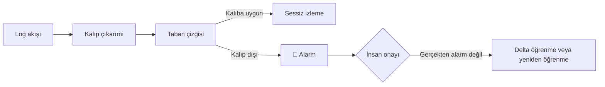

# SRE-FOR-ALL

> Logunuzun formatı ne olursa olsun, onu okuruz. Log içeriğindeki anomalileri yakalar, sağlıklı akışı öğrenir ve öğrenilenin dışına çıkan her akışta alarm üretiriz — her şey tamamen sizin ortamınızda, sizin gözetiminizde.

🚧 **Durum:** Aktif geliştirme aşamasında. Güncel ilerleme (2026-09-06):

- ✅ **Çalışma kuralları** — [`CONVENTIONS.md`](CONVENTIONS.md): 11 MUST kuralı (streaming I/O, `pipeline.py` uyumu, `--debug`, tam parametriklik, LLM wire logları, canlı `report.json`, oturum günlüğü, modül dokümantasyonu…)
- ✅ **Geliştirme ortamı** — Docker konteyneri + SSH ile lokal erişim; konteyner her zaman sıfırdan kurulabilir, her şey proje klasöründe yaşar
- ✅ **`sanitize.py`** — log temizleyici: Türkçe→ASCII, `a-zA-Z0-9`+boşluk filtresi, satırları `SOL … EOL` ile tek satıra stitch eder (~51–91 bin satır/sn, testli)
- ✅ **`chunk.py`** — token bütçeli dilim kesici: AI'a gönderilecek ~N token'lık metni keser, **son kelime daima EOL** — yarım satır gitmez (20/20 test bataryası geçti)
- ⏭️ Sıradaki halka: dilimi LLM'e gönderecek modül

Modüllerin kimlik kartları: [`MODULES.md`](MODULES.md) · oturum günlüğü: [`DEVLOG.md`](DEVLOG.md)

---

## Kapsam — net çizgiler

Bu yazılım **log içeriğini** anlar: logunuzdaki mevcut yapıyı çözer, uygulamayla ilgili hataları ve olağan dışı durumları yakalar; uygulama özelinde bir sorun varsa alarm üretir. Müşterinin *davranışındaki* anomaliyi (ör. alışkanlıklarının değişmesi) bulmaz — bu, yazılımın kapsamı dışındadır.

### ✅ Neleri yapar?

- **Uygulama loglarında oluşan müşteri veya uygulama hatalarını** — yani normalde oluşmayan şeyleri — yakalar ve alarm üretir.
- **Bilinen "yalancı" hataları ayıklar:** Logda bir error kaydı vardır ama gerçekte hata değildir; bu tür bilinen formları yok sayabilir.
- **Deployment sonrası görünürlük sağlar:** Deploy sonrası beklenmedik durumları veya o deployment ile gelen değişiklikleri görmeyi kolaylaştırır.
- **LLM çağrı maliyetini drastik düşürür:** Kalıplar, her bir kalıptan kaç adet geldiğini özetler. Kalıp dışı davranışla birlikte genel davranış da eklendiğinde **tam kapsamlı (full-coverage) bir AI özeti** çok daha az çağrıyla alınır. AI yönlendirici bir aksiyon önerirse bu aksiyon kullanıcıya sunulur.

### ❌ Neleri yapmaz?

- Uygulama **log üretmezse** onu yakalamaz.
- Normalden **az** log üretmeye başlarsa onu yakalamaz (hacim anomalisi kapsam dışıdır).

## Nasıl çalışır?

- **Format bağımsız log okuma** — Logunuz JSON mu, düz metin mi, kendi özel formatınız mı? Fark etmez; olduğu gibi okuruz.
- **Anomali tespiti** — Log içeriğindeki mevcut anomalileri (uygulama hataları, olağan dışı satırlar) yakalarız.
- **Sağlıklı kalıp çıkarımı** — Anomali yoksa, logunuzdaki *sağlıklı* kalıpları çıkarıp bir taban çizgisi (baseline) oluştururuz.
- **Kalıp dışı akışta alarm** — Bu kalıpların dışına çıkan bir akış geldiğinde alarm üretiriz.



## Yeni deployment sonrası ne olur?

Yeni bir deployment yaptınız ve yeni log tipleri oluşmaya başladı. Sorun değil:

1. Her yeni log tipi için **alarm üretiriz** — hiçbir şey sessizce geçmez.
2. Bunların gerçek alarm olmadığına siz karar verirsiniz. Onayınızdan geçen satırlar için iki seçeneğiniz vardır:
   - İlgili satırları **delta öğreniciye** göndermek — mevcut bilgilere ekleme yapar,
   - Öğrendiklerini silip **sıfırdan yeniden öğrenmesini** sağlamak.

## Best of both worlds

Sonuç: elinizde hem her zaman **bekleneni yapan statik bir program**, hem de **öğrenebilen ve size zahmet vermeyen bir dinamizm** olur.

## Müşteri verilerini de korur

Bu uygulamayı aynı zamanda şu amaçla da kullanabilirsiniz: **loglarınızı dışarıyla paylaşırken müşteri verilerinizin sızmasını önlemek.**

- LLM'in tespit ettiği kuralı beğenmezseniz **manuel olarak müdahale edebilir**, otomatik etiketleri değiştirebilirsiniz.
- Son söz her zaman makinenin değil, **sizin** olur.

## Eşleştirme gücü

- ✅ **Kolon + kelime (word) desteği**
- ✅ **Regex desteği**

İhtiyacınıza göre basitten karmaşığa ölçeklenen iki eşleştirme yaklaşımı sunarız.

## Geliştirme ortamı (repo için)

```bash
# 1) .dev-keys/ altına ed25519 anahtar çiftinizi koyun
#    (id_ed25519 + authorized_keys — .gitignore'lidir, asla commitlenmez)
docker compose up -d --build

# 2) konteynere girin (proje /workspace altında mount'ludur)
ssh -i .dev-keys/id_ed25519 -p 2222 dev@127.0.0.1
```

Konteyner yok edilip yeniden kurulsa bile proje klasörü tek başına yeterlidür (Kural 10).
Büyük log verileri (`example_logs/`, `data/`) bilinçli olarak git dışındadır — yalnız lokalde durur.

## Çalışmak için neye ihtiyaç duyar?

Yalnızca iki şey:

1. **Docker** — Uygulama tamamen Docker içinde çalışır. Kurulu bir Docker yeterlidir; hazır paket olarak sunuyoruz — çekin, çalıştırın, ekstra kurulum yok.
2. **Bir AI (LLM) API anahtarı** — [OpenRouter](https://openrouter.ai) üzerinden alınır. Tavsiye ettiğimiz uygun fiyatlı modeller:
   - **GLM-5.3-Flash** — hızlı ve ekonomik,
   - **DeepSeek** — güvenilir iş atı (workhorse),
   - **Qwen ailesinden biri** — bütçe dostu alternatif.

## LLM entegrasyonu

- [OpenRouter](https://openrouter.ai) üzerinden **en çok tercih edilen AI modellerinden herhangi birini** kendi API anahtarınızla bağlayabilirsiniz.
- Maliyet dostudur: kalıplar ve tekrar sayıları sayesinde az sayıda LLM çağrısıyla tam kapsamlı analiz alınır.
- Her şey **tamamen kendi yerel ortamınızda** ve **sizin gözetiminizde** çalışır.
- **Derlenmiş kod yok, siyah kutu yok** — kaynak kodun tamamı okunabilir Python betiğidir.
